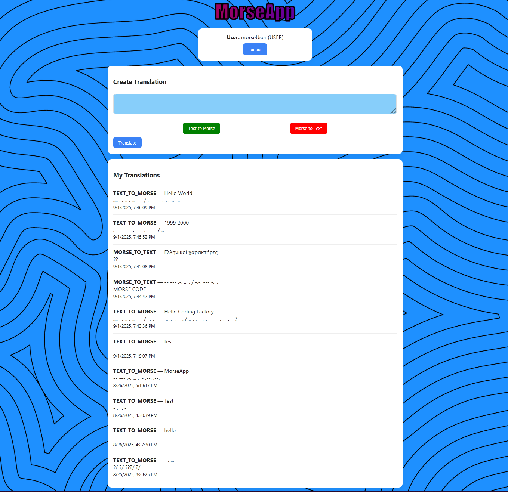

# **MorseApp**

An education full-stack application that converts text to morse code and vice versa. Has authentication and translation history (last 10 translations).

## Contents

- **Database** (MySQL8)

- **Backend** (Spring Boot + REST API with JWT authentication)

- **Frontend** (Vite + React)

- **Postman** (collection + environment)


## Requirements

- MySQL8 (running locally at localhost:3306)

- Java 17

- Gradle (gradlew)

- Node.js 18+

- Git

## How to run the application  

### Database

run database/sqlmorseapp-with-user.sql to create the schema and user.

### Backend

Run the application:
```bash
cd morseapp-cf-final/backend
./gradlew clean bootRun
```

### Frontend

Install dependencies and start server:
```bash
cd morseapp-cf-final/frontend
npm i
npm run dev
```

*frontend runs on: http://localhost:5173*

### Testing

Run Unit tests:
```bash
cd morseapp-cf-final/backend
./gradlew clean test
```

Swagger UI: http://localhost:8080/swagger-ui/index.html


**NOTES**

database credentials (exposed, project is for educational purposes):

```bash
name:      morseUser

password:  12345
```

## App Preview

### Login Page:


### Translation Page:


